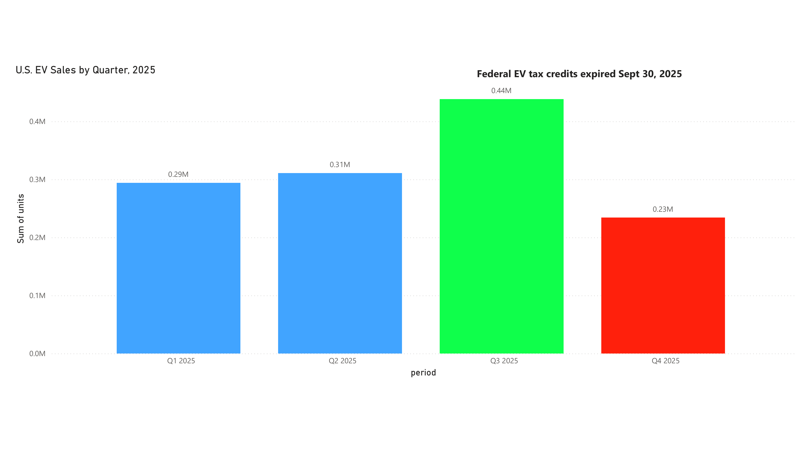
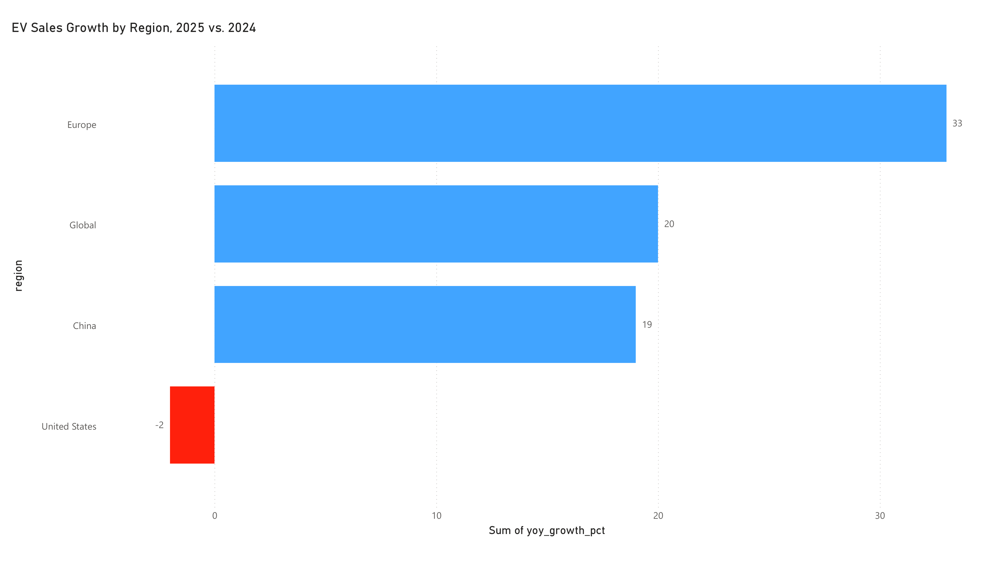

# U.S. vs. global EV market performance, 2025

## Business question

While global EV sales grew 20% in 2025, U.S. EV sales were flat-to-declining. What does this
divergence reveal about the role of policy incentives versus market maturity, and what does
it mean for automakers planning U.S. strategy?

## Key finding

The U.S. EV market didn't lose consumer interest in 2025 — it lost a policy tailwind. Two
federal tax credits expired on September 30, 2025, and the effect on demand was immediate and
severe: U.S. EV sales hit an all-time quarterly record of 438,487 units in Q3 (10.5% market
share) as buyers rushed to use the credits, then collapsed to 234,171 units in Q4, down 36%
year-over-year. Meanwhile, markets without an equivalent policy cliff kept growing — Europe by
33%, and the world overall by 20%.

The U.S. isn't structurally behind on EV demand. It just built a large share of 2025's demand
on a subsidy with a hard expiration date, and the market has not yet found a replacement
source of growth.

## Charts





## Data and methodology

Data compiled from six primary industry sources (Cox Automotive / Kelley Blue Book, IEA,
Benchmark Mineral Intelligence, CAAM, ICCT, and U.S. EIA) — see [sources.md](sources.md) for
full citations and links.

No single public dataset covers this comparison, so the dataset here was built by hand from
quarterly and annual reports. This surfaced a data-quality issue worth noting directly rather
than smoothing over: China's 2025 EV figure is reported two different ways depending on the
source and definition used.

- **IEA ("electric cars")**: ~12.8 million units — BEV + PHEV passenger cars only
- **CAAM ("NEV")**: ~16.49 million units — a broader vehicle category

Charts and analysis in this project use the IEA definition consistently, and this
discrepancy is flagged rather than picked silently, since mixing definitions across a
dashboard is a common and avoidable source of error.

## Tools

- Python (pandas, matplotlib) for data compilation and charting
- Power BI for the interactive dashboard version (see `dashboard/`)

## Files

```
├── README.md
├── data/
│   ├── us_quarterly_2025.csv
│   └── regional_growth_2025.csv
├── images/
│   ├── us_quarterly_ev_sales_2025.png
│   └── regional_growth_comparison_2025.png
├── dashboard/
│   └── ev_market_dashboard.pbix
└── sources.md
```

## About

Built by Bhagwant Negi as part of an MS in Applied Data Analytics, drawing on prior experience
in automotive sales and business development (Honda, Mahindra & Mahindra) to frame the
business implications of the data.
